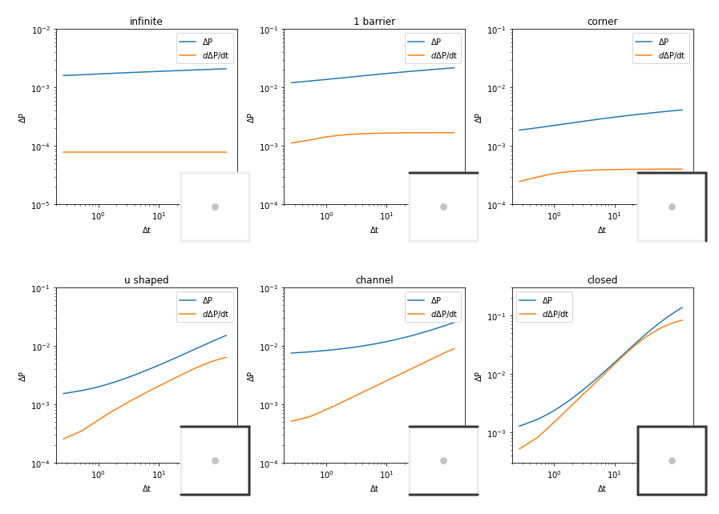

# Título do Trabalho

#### Aluno: [Rodrigo Araújo](https://github.com/rodrigoaraujo01)
#### Orientador: [Leonardo Mendoza](https://github.com/link_do_github).

---

Trabalho apresentado ao curso [BI MASTER](https://ica.puc-rio.ai/bi-master) como pré-requisito para conclusão de curso e obtenção de crédito na disciplina "Projetos de Sistemas Inteligentes de Apoio à Decisão".

- [Link para o código](https://github.com/rodrigoaraujo01/AutoencodersBarrierDetectionWellTest).

- [Link para o relatório](https://github.com/rodrigoaraujo01/AutoencodersBarrierDetectionWellTest/blob/master/Report.md).

---

### Resumo

Na área de avaliação de formações, a variação de pressão medida no interior do poço e sua derivada no tempo são avaliadas através de gráficos loglog em busca de valores de transmissibilidade ($\frac{k h}{\mu}$), dano à formação (_skin_), pressão extrapolada, etc.

A análise de padrões nesses gráficos também permite estimar a presença de barreiras nas proximidades do poço, conforme figura abaixo.

Este trabalho consistiu na investigação de um conjunto de treinamento de 10.000 testes de formação sintéticos contemplando as 6 configurações de barreiras apresentadas acima: reservatório infinito (sem barreiras), reservatório com 1 barreira, 2 barreiras em 90 graus, 3 barreiras em U, 2 barreiras paralelas e fechado. 

Esses dados foram segregados e manipulados de diferentes formas para treinar redes neurais do tipo [autoencoder](https://blog.keras.io/building-autoencoders-in-keras.html), e as camadas de codificação foram então usadas para segregar os diversos modelos entre si atingindo ótimos resultados.

Essa solução possui duas aplicações práticas no dia a dia da avaliação de reservatórios conforme descritas abaixo.

1. Construção de assistentes de interpretação de testes capazes de sugerir um esquema de barreiras com base nos dados brutos de variação de pressão e sua derivada;
2. Viabilização da comparação de testes em diferentes campos através da redução de dimensionalidade dos dados.

---

Matrícula: 192.190.075

Pontifícia Universidade Católica do Rio de Janeiro

Curso de Pós Graduação *Business Intelligence Master*
