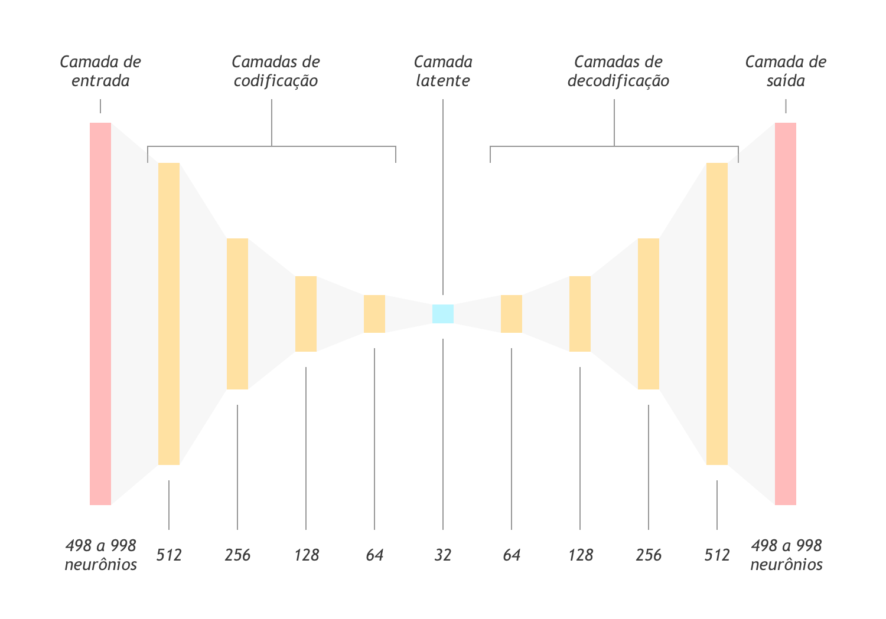
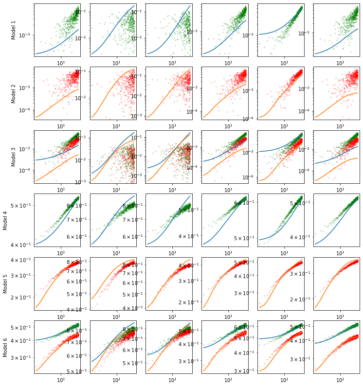
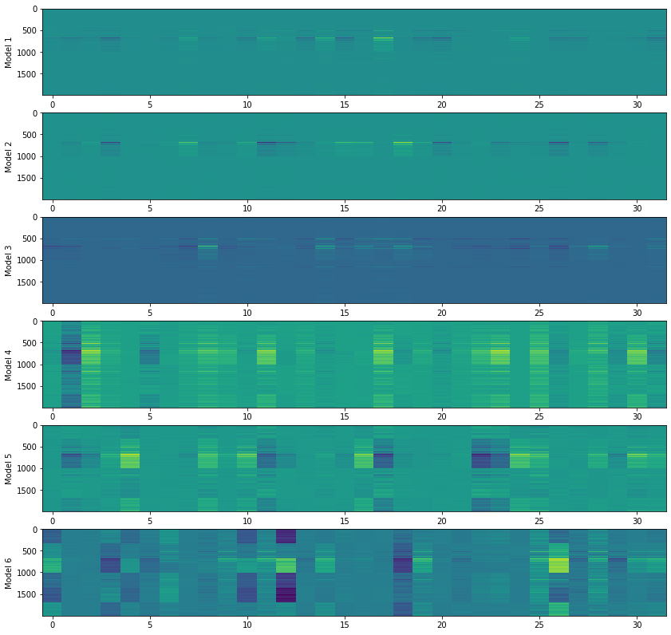
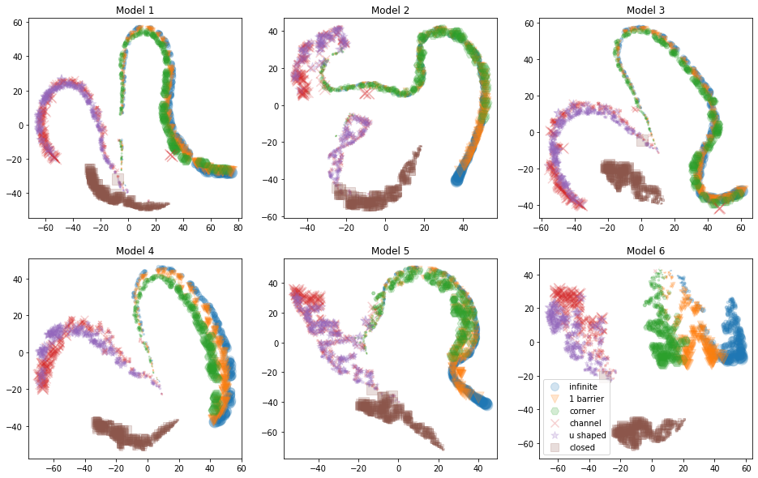
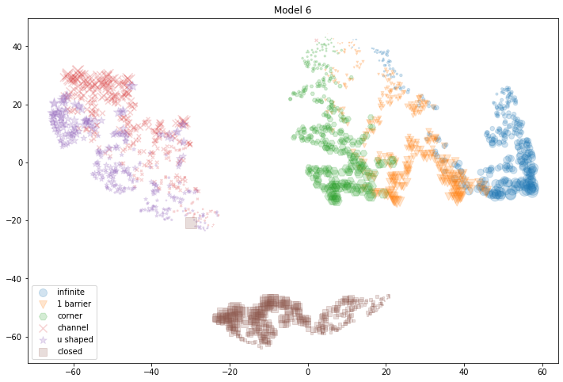
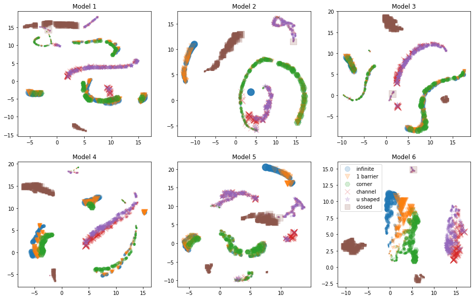
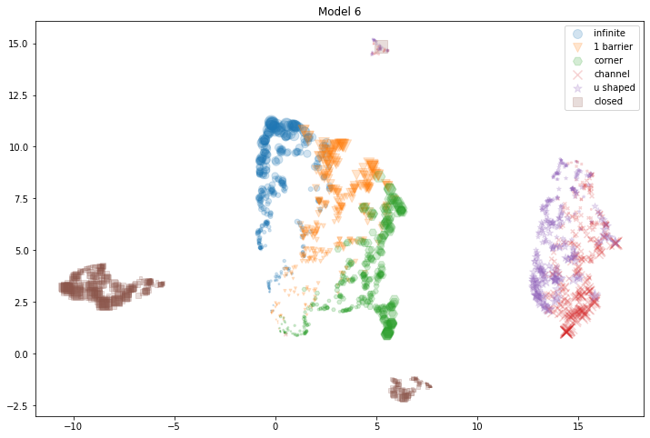

# BI Master

## Autoencoders para detecção de esquemas de barreiras

### Introdução

Na área de avaliação de formações, a variação de pressão medida no interior do poço e sua derivada no tempo são avaliadas através de gráficos loglog em busca de valores de transmissibilidade ($\frac{k h}{\mu}$), dano à formação (_skin_), pressão extrapolada, etc.

A análise de padrões nesses gráficos também permite estimar a presença de barreiras nas proximidades do poço, conforme figura abaixo.

### Objetivo do trabalho

Este trabalho consistiu na investigação de um conjunto de treinamento de 10.000 testes de formação sintéticos contemplando 6 configurações de barreiras: reservatório infinito (sem barreiras), reservatório com 1 barreira, 2 barreiras em 90 graus, 3 barreiras em U, 2 barreiras paralelas e fechado. 

Esses dados foram segregados e manipulados de diferentes formas para treinar redes neurais do tipo [autoencoder](https://blog.keras.io/building-autoencoders-in-keras.html), e as camadas de codificação foram então usadas para segregar os diversos modelos entre si atingindo ótimos resultados.

Essa solução possui duas aplicações práticas no dia a dia da avaliação de reservatórios conforme descritas abaixo.

1. Construção de assistentes de interpretação de testes capazes de sugerir um esquema de barreiras com base nos dados brutos de variação de pressão e sua derivada;
2. Viabilização da comparação de testes em diferentes campos através da redução de dimensionalidade dos dados.

### Metodologia

#### Conjunto de entrada

Este trabalho utilizou um conjunto de 10.000 testes de formação sintéticos. Esses testes foram construídos usando amostras aleatórias de diversas propriedades de reservatórios, conforme apresentado na tabela abaixo.

|Propriedade|Valor mínimo|Valor máximo|
|---|---|---|
|Permeabilidade — k (md)|50|1000|
|Altura do reservatório — h (m)|10|300|
|Fator Volume Formação do Óleo — Bo (m3/m3)|1|2|
|Pressão inicial — Pi (kgf/cm2)|50|600|
|Dano à formação — skin|-2|5|
|_Porosidade_*|20%|20%|20%|
|_Compressibildade total (cm2/kgf)_*|1e-5|1e-5|1e
|_Viscosidade — $\mu (cp)$_*|1|1|
\* As propriedades marcadas com * não tiveram variação entre os modelos

Cada um dos reservatórios foi submetido ao esquema de fluxos e estáticas apresentado abaixo.

|Etapa|Duração|Vazão|
|---|---|---|
|Fluxo 1|10h|200 m3/d|
|Estática 1|24h|0|
|Fluxo 2|50h|200 m3/d|
|Estática 2|48h|0|

### Definição dos conjuntos de treino e teste

Inicialmente, foram construídos 3 conjuntos de treinamento e teste, conforme lista abaixo.

1. Contendo apenas os dados de variação de pressão ($\Delta P$);
2. Contendo apenas os dados de derivada da variação de pressão ($\frac{d\Delta P}{dlnt}$);
3. Contendo ambos os dados de variação de pressão e sua derivada.

Porém, como as variações de pressão são proporcionais ao logaritmo da variação do tempo no fenômeno físico de fluxo em meio poroso, também foram construídos 3 conjuntos adicionais com base no logaritmo dos 3 conjuntos iniciais:

4. Contendo o logaritmo dos dados do conjunto 1;
5. Contendo o logaritmo dos dados do conjunto 2;
6. Contendo o logaritmo dos dados do conjunto 3;

### Redes autoencoders

Autoencoders são algoritmos de compressão e descompressão implementados através de redes neurais. 

O treinamento desse tipo de rede é realizado definindo as saídas esperadas como cópias do conjunto de entrada podendo incluir pequena variações. A arquitetura dessas redes prevê dois blocos distintos: um de codificação e outro de decodificação.

No primeiro bloco, o número de neurônios em cada camada diminui progressivamente, chegando ao mínimo na camada latente. A partir desta camada, o número de neurônios volta a crescer (usualmente de forma simétrica), chegando a uma camada de saída com a mesma quantidade de neurônios da camada de entrada.

A capacidade dessas redes de compactar a informação até a camada latente e reconstruí-la em seguida, leva à conclusão que a informação contida na camada latente é uma "representação mínima" dos dados de entrada. Assim, essa rede pode ser uma alternativa interessante na redução de dimensionalidade de conjuntos de dados complexos.

Assim, foram construídas 6 redes autoencoders diferentes (uma para cada conjunto de entrada), mas com as mesmas distribuições de camadas de codificação e decodificação, conforme apresentado na figura acima. Todas essas redes foram treinadas em 1000 épocas.

### Resultados obtidos

A figura abaixo apresenta gráficos de casos aleatórios do conjunto de entrada (linhas) e os resultados obtidos na camada de saída das respectivas redes (dispersões de pontos).

Os resultados indicam a superioridade dos modelos que usam dados logarítmicos. Dentre esses, o modelo 6, que usa todos os dados disponíveis, foi aquele que se aproximou mais das curvas de entrada.

É importante frisar que, apesar da estratégia de treinamento adotada, o objetivo dessas redes não é reconstruir perfeitamente o dado de entrada. O aprendizado da rede precisa ser suficiente para que ela torne-se capaz de compreender as diferenças entre os diversos esquemas de barreira possíveis no teste.

### Análise das representações mínimas dos testes

As camadas iniciais de cada uma das 6 redes autoencoders foram usadas para construir redes codificadoras. Em seguida, as novas redes foram usadas para construir representações mínimas de 32 dimensões dos dados de validação.

Na figura abaixo, encontram-se representados os 2000 resultados de cada um dos 6 conjuntos de validação. Cada linha representa uma amostra do conjunto, e cada coluna, os valores obtidos em cada um dos neurônios da camada latente.

Os dados de validação foram previamente ordenados com base nos 6 esquemas de barreiras. Para os modelos de 1 a 3 (construídos sem pré-processamento logarítmico), há pouca diferenciação entre os blocos horizontais. Porém, a partir do modelo 4, é possível verificar uma clara separação em 6 grupos, culminando no modelo 6.

#### Visualização em 2 dimensões

Os algoritmos [T-SNE](https://lvdmaaten.github.io/tsne/) e [UMAP](https://umap-learn.readthedocs.io/en/latest/index.html) foram usados para reduzir a dimensionalidade das representações de 32 para 2 dimensões e assim facilitar a visualização dos resultados.

**Usando o algoritmo T-SNE**

A figura abaixo apresenta os resultados obtidos com todos os modelos. Os melhores resultados, conforme esperado, foram obtidos usando o conjunto número 6 que contem os valores logarítimicos da variação de pressão e da sua derivada no tempo.

A figura abaixo apresenta os resultados do modelo 6 de forma ampliada.

**Usando o algoritmo UMAP**

A figura abaixo apresenta os resultados dos 6 modelos usando UMAP.

A figura abaixo apresenta os resultados do modelo 6 de forma ampliada usando UMAP.

## Conclusões

Apesar de nenhuma das redes ter atingido uma repetição perfeita dos valores de entrada, as camadas de codificação das redes autoencoders se mostraram capazes de segregar os diferentes modelos de barreiras no reservatório.

A análise de 6 diferentes conjuntos de entrada permitiu perceber a importância do uso de todos os dados disponíveis, e da sua inclusão do conhecimento físico, ao convertê-los em escala logarítimica.

Os únicos modelos que não apresentaram grande separação foram os reservatórios em formato de U e de canal. Esses casos são notadamente similares, e também geram dificuldades para os intérpretes humanos. Ainda assim, mesmo com os conjuntos próximos, há uma pequena separação entre os dois nas nuvens de pontos obtidas no T-SNE e no UMAP.

## Próximos passos

Esse estudo comprova a hipótese de que é possível chegar a uma representação mínima dos dados de teste de formação. Assim, os próximos passos consistem em avaliar a melhor forma de aplicar essa estratégia à conjuntos de dados reais.

Além disso, há espaço para a construção de features derivadas dos dados de entrada, como proposto por Tian, C. e Horne, R. N. (2015), em busca de uma segregação ainda melhor.